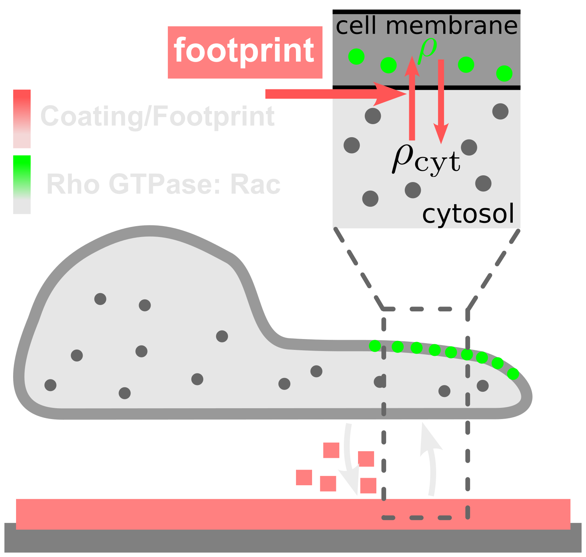
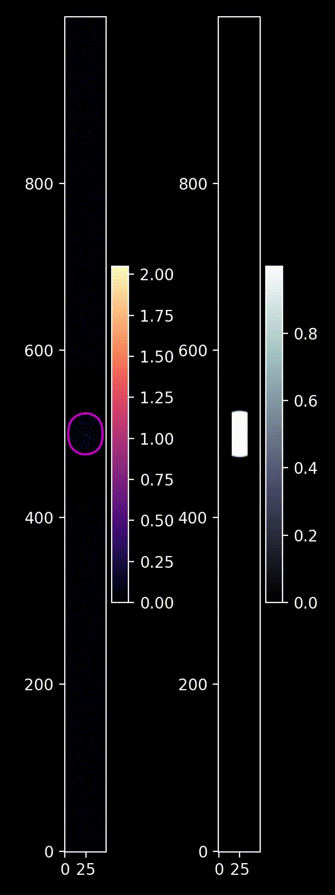

## Cells modify their environment as they move  

Cells don’t just move across their environment—they reshape it as they go, leaving *footprints* that can strongly influence their future motion. A central goal of my research is to understand how these feedbacks between cell motility and the environment generate new migration strategies in both single cells and collectives.  

<figure style="display: flex; flex-direction: column; align-items: center;">
	
	<figcaption>HT-1080 fibrosarcoma epithelial cell moving on the extracellular matrix. Developmental cell, 56(6), 826-841
     </figcaption>
</figure>

---

### Cells use their footprints to change their migration strategies

In my recent research, I explored how cells can change their migration strategies by interacting with molecular footprints they leave behind. My work builds on studies showing that migrating cells leave molecular footprints on the ECM, which can induce oscillatory motion.

We developed a mechanistic framework that couples cell shape, a deposited footprint, and intracellular polarity signaling. In the model, a phase‑field description of the cell is linked to a polarity module in which local contact with the footprint activates Rac1, biasing protrusion toward previously explored regions. This creates a positive feedback loop: the cell moves, deposits more footprint, and becomes more likely to move along that path again. 

	

Geometry plays a central role. On 1D micropatterned stripes, our model reproduces oscillations whose amplitude grows as cells repeatedly revisit their own tracks. 

<figure style="display: flex; flex-direction: column; align-items: center;">
	

		
		
	

	<figcaption>Two motility modes. Left: the cell oscillates, turning at the edge of its footprint, with the oscillation amplitude increasing over time. Right: the cell advances persistently in one direction into areas it has not previously visited.</figcaption>
</figure>

By varying two key factors— such as the rate cells deposit footprint—we find sharp transitions among confined motion, oscillatory back‑and‑forth motion, and persistent exploration. Small parameter changes can therefore produce large behavioral shifts, suggesting that modest biochemical or mechanical regulation may toggle a cell between being trapped and being exploratory.

<figure style="display: flex; flex-direction: column; align-items: center;">
	
	<figcaption>Gromit frantically lays down train tracks just ahead of a speeding locomotive. From Wallace &amp; Gromit: The Wrong Trousers (1993).</figcaption>
</figure>

In 2D, the same basic mechanism yields two distinct outcomes: circularly confined trajectories that slowly expand, and fully exploratory paths that escape confinement. We revisited experiments on 2D substrates and observed both expanding circular motion and exploratory migration, consistent with the model’s predictions.

<figure style="display: flex; flex-direction: column; align-items: center;">
	
<figcaption>Cells on a 2D substrate display different exploratory behaviors depending on how rapidly they modify their environment.</figcaption>
</figure>

Overall, our results support a simple principle with broad implications: cells can use their own footprints to control their migration strategy.

---

<!-- ### Collective effects and guidance efficiency  

Footprints also serve as local guidance cues for other cells, enabling leader–follower coordination during collective migration. I study how footprint persistence, density, and degradation shape the efficiency of such guidance, and under which conditions footprints enhance cooperative migration or instead generate crowding and jamming effects. More broadly, I am developing models to assess how footprints affect navigation efficiency, by comparing target search times with and without footprint cues in noisy or degrading environments.  

---

### Detecting the signatures of footprint interactions  

Because footprints are often invisible, their role must be inferred from cell trajectories. I identify their signatures through statistical properties such as revisits, velocity correlations, and aging in mean squared displacement. By fitting motility models with Bayesian inference, I extract quantitative parameters like confinement strength and memory timescales. This approach provides a way to reveal and measure footprint interactions even when they cannot be directly observed.  

--- -->

- **Perez Ipiña, E.**, d'Alessandro, J., Ladoux, B., Camley, B. A. *Deposited footprints let cells switch between confined, oscillatory, and exploratory migration*. *Proceedings of the National Academy of Sciences* 121.22 (2024): e2318248121 [link](https://doi.org/10.1073/pnas.2318248121).