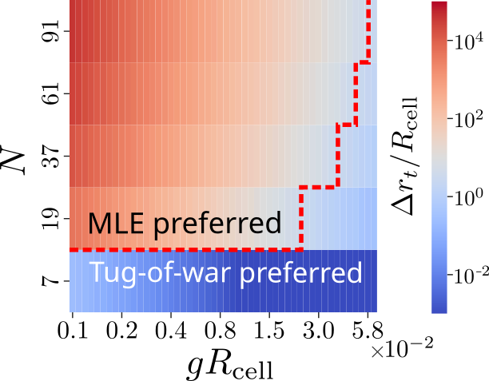

<!-- # Cell Sensing and Navigation: From Individual Precision to Emergent Collective Behavior -->

Eukaryotic cells are capable of detecting and responding to chemical gradients in their environment, a function essential for processes such as immune response, embryogenesis, and cancer metastasis. These behaviors are governed by physical mechanisms that operate both at the level of single cells and within multicellular groups. My research is focused on elucidating how cells, individually and collectively, acquire sensory information and translate this into directed movement, particularly in the presence of stochastic fluctuations.

---

## Gradient Sensing by Single Cells: Quantitative Limits and Biological Variability

The initial step in gradient sensing involves ligand molecules binding to cell-surface receptors. The accuracy with which individual cells can estimate external concentrations is limited by several sources of noise:

- **Ligand-receptor binding fluctuations:** Diffusive arrival and stochastic binding/unbinding of molecules introduce temporal noise into receptor occupancy.
- **Cell-to-cell variability (CCV):** Genetically identical cells can display substantial heterogeneity in molecular and functional properties, often exceeding ligand-receptor noise in magnitude.

During my doctoral research, I developed mathematical frameworks to quantify the precision of concentration measurements by cells, accounting for relevant time scales of biological decision-making. Building on the foundational work of Berg and Purcell, these models provide analytic expressions for the autocorrelation of molecular input signals, valid across all time regimes.

**Main results include:**
- **Short-time accuracy:** Corrections to standard concentration estimation can allow the error to decrease more rapidly for short integration times. This fast convergence is relevant for transient processes such as chemotaxis and binding dynamics in gene regulation.
- **Applications:** The framework explains observed phenomena, such as the precision of Bicoid gradient sensing in *Drosophila* embryos and changes in noise properties of enzymatic activity, by connecting measurement accuracy to transport and reaction kinetics.

---

## Collective Gradient Sensing: Role of Positional Information

Groups of cells frequently exhibit enhanced gradient detection compared to isolated cells. In our work, we consider how the accuracy of collective sensing depends on the ability of individual cells to localize themselves within the cluster—referred to as **positional information**.

Applying a maximum likelihood estimation (MLE) approach, we found:

- **Impact of uncertainty:** Inaccuracies in positional information reduce the overall precision of gradient estimation, especially in steep gradients where spatial mislocalization results in significant concentration error.
- **Edge contribution:** Cells at the edge of a cluster contribute disproportionately to collective sensing; prioritizing positional information for edge cells is the most efficient allocation if information acquisition is limited.
- **Scaling with group size:** Larger clusters are less affected by positional uncertainty, as individual measurement errors are averaged out.

---

## Alternative Mechanisms: Tug-of-War Model

Cells may also coordinate movement without explicit positional knowledge. Based on observations in neural crest and lymphocyte clusters, we compared the MLE framework to a **tug-of-war (ToW) model:**

- Cells polarize and exert force away from immediate neighbors via contact inhibition of locomotion, with polarization restricted to edge cells.
- In the presence of a gradient, edge cells at the front polarize more strongly, resulting in net directional migration.

**Comparison of the two models suggests:**

- **Smaller clusters or steep gradients:** The ToW mechanism can yield more accurate orientation than strategies dependent on positional information, particularly when most cells are at the cluster edge.
- **Larger clusters or shallow gradients:** The MLE approach becomes optimal as the integration of multiple measurements compensates for positional uncertainty.

We constructed phase diagrams delineating the conditions under which each strategy achieves superior accuracy, suggesting that cell clusters may employ distinct mechanisms in different contexts.

<figure style="display: flex; flex-direction: column; align-items: center;">
    
<figcaption>Phase diagram showing the trade-off between MLE and tug‑of‑war models across cluster size and gradient steepness.</figcaption>
</figure>

---
- **Perez Ipiña, E.**, & Camley, B. A. (2022). Collective gradient sensing with limited positional information. *Physical Review E*, 105(4), 044410 [link](https://doi.org/10.1103/PhysRevE.105.044410).
- **Perez Ipiña, E.**, & Ponce Dawson, S. (2016). Fluctuations, correlations, and the estimation of concentrations inside cells. *PLOS ONE*, 11(3), e0151132 [link](https://doi.org/10.1371/journal.pone.0151132).