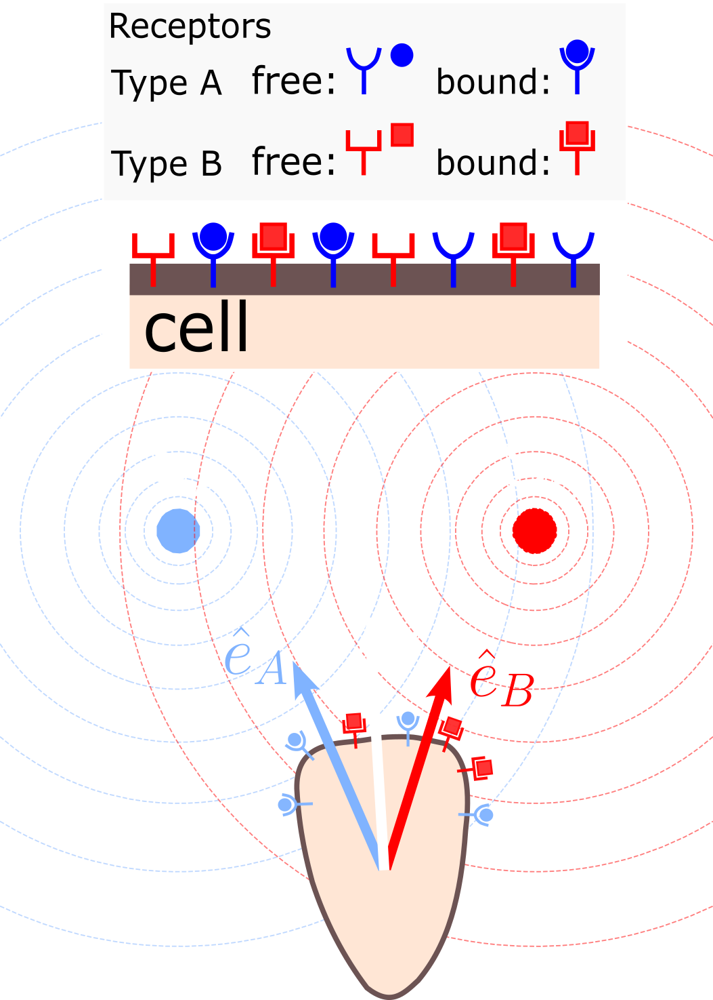
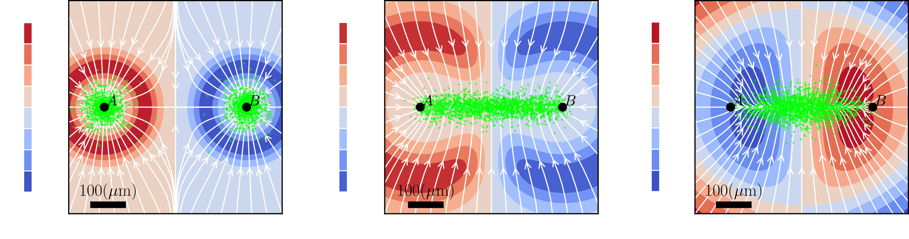

Cells constantly navigate complex environments where they are exposed to **multiple, often overlapping and contradictory chemical gradients**. Understanding how cells integrate and prioritize these competing cues, deciding when to follow local versus distant signals, is critical for biological processes such as immune responses and tissue repair. Experimental observations reveal diverse behaviors, including cells prioritizing distant sources, exhibiting multistep navigation, or showing oscillatory motion and confinement between opposing gradients.

Our research proposes that many of these complex chemotactic behaviors can be explained by considering the **precision with which cells sense each chemical gradient**. This precision, quantified as the **signal-to-noise ratio (SNR)**, is **non-monotonic** with chemoattractant concentrations; cells sense gradients most accurately at intermediate concentrations and less effectively at very low or very high ones.

Our model treats cells as active random walkers that possess independent receptors for different chemoattractants. They independently estimate the direction of each local gradient, and these individual estimates are then **integrated through a vector sum** to determine the overall movement direction. Crucially, cells effectively **weight their movement bias towards the gradient they sense more accurately** (i.e., the one with a higher SNR). This simple principle can explain a wide range of observed phenomena without needing to invoke more complex mechanisms like memory or receptor desensitization.

### Key Findings Explained by Gradient Sensing Accuracy:

*   **Diverse Spatial Patterns and Confinement:** The model predicts that depending on the **decay length (λ)** of the gradients, cells can exhibit different behaviors.
    *   For **small λ**, SNR peaks are close to the sources, leading cells to **migrate toward the nearest source**.
    *   For **larger λ**, SNR peaks shift and can cross, causing cells to **oscillate or become confined** to a region between the sources, referred to as an "equipotential region" where chemotactic responses balance out.
    *   An **intermediate λ*** results in SNR peaks overlapping centrally, leading to **no directional bias** and broader cell dispersion.

*   **Hierarchical Chemotactic Response and Multistep Navigation:** This model explains why cells might prioritize certain "end-target" chemoattractants (like fMLP) over "intermediate" ones (like IL-8 or LTB4). This hierarchy emerges from **differences in cellular sensitivity** to each chemoattractant, such as varying receptor numbers. If a cell has more receptors for one chemoattractant, it creates an **asymmetric chemotactic response map**, where larger regions favor recruitment towards that more sensitively sensed source. This naturally leads to **multistep navigation**, where a cell might initially move toward a weaker source before redirecting its trajectory to the preferred, more accurately sensed source.

*   **Impact of Source Strength (S0):** Variations in the concentration magnitude at the source can alter the spatial distribution of cells, changing from elongated along the source axis to increased dispersion perpendicular to it for large S0 values.

In essence, our research highlights that the **fundamental accuracy of a cell's gradient sensing** is a primary driver of how it navigates and organizes itself in complex, multi-signal environments. The model provides **testable hypotheses** for future experiments by predicting how changes in chemoattractant concentration, source distance, or receptor numbers could alter cell migration and distribution. This principle could be exploited to strategically organize cell distributions, for example, to concentrate immune defenses in specific areas.

Think of it like a **navigator trying to find their way using multiple, potentially conflicting maps, each with varying levels of detail and accuracy**. Instead of blindly following any single map, the navigator intuitively trusts the maps that provide the clearest, most reliable information, even if it means taking a longer or seemingly indirect path to their destination.

---
- **Perez Ipiña, E.**, & Camley, B. A. (2025). Competing chemical gradients change chemotactic dynamics and cell distribution. *arXiv* preprint arXiv:2507.19341 (2025) [link](https://doi.org/10.48550/arXiv.2507.19341).